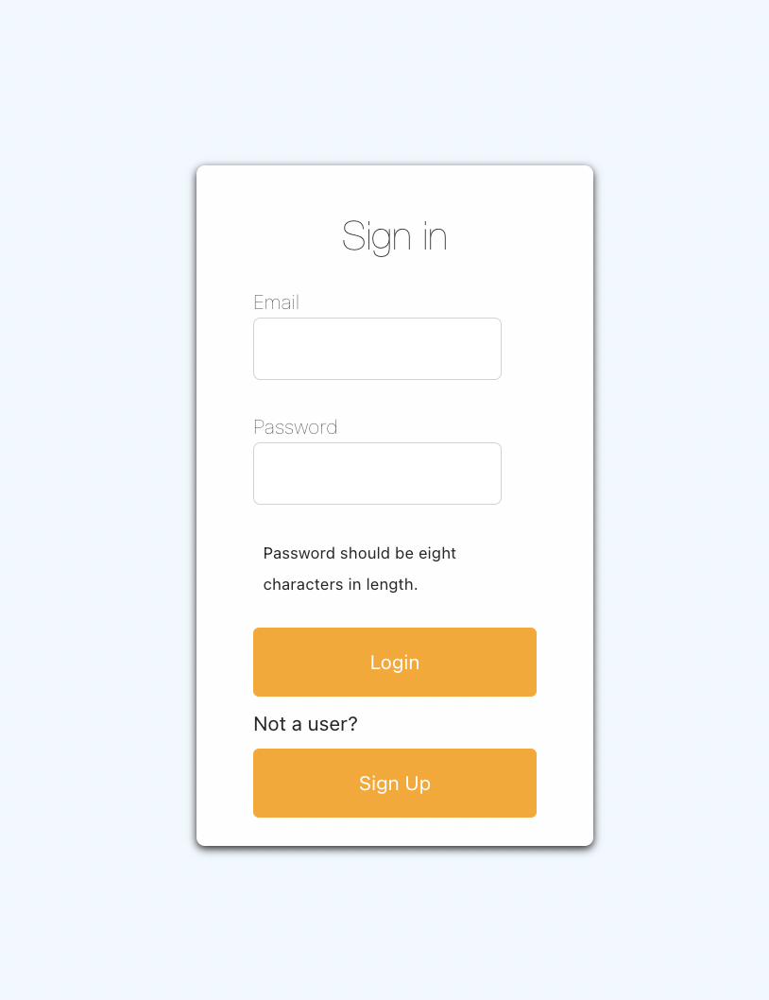
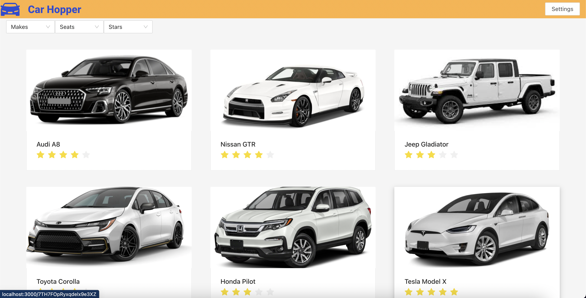
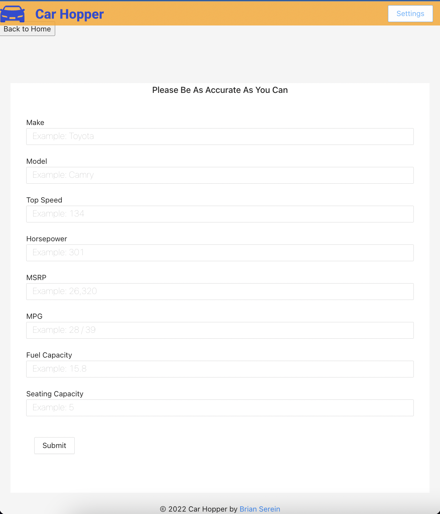

# Created A Car Rating Site with the option to add additional vehicles.

This website is both responsive and accessible.
  
 

## 
 Login Page  
There is also a Sign Up page that is similar to the Sign In page.

##    
 Main Page
Here you have the opportunity to browse the selection of cars and filter to look for the car you have in mind.
 

##   
 Detail Page
Rate the cars you have with a star system, 1 star being the worst and 5 stars being the best. It also includes some information about the vehicle.
 

##   
 Add A New Car Page
You can add info of a car you would like to see in the selection, which will be sent to be reviewed by an admin after to verify the accuracy of the submission.
 

